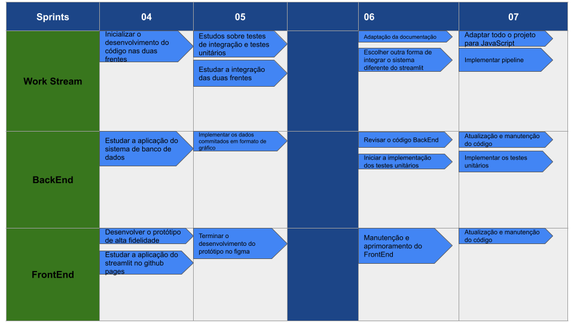
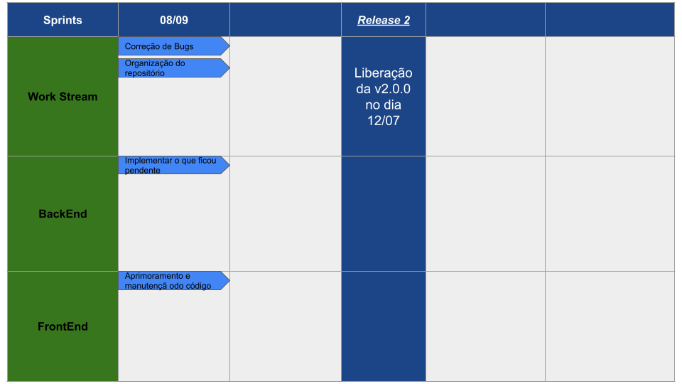

## Histórico de versões

| Data       | Versão | Descrição                      | Autor             |
| :--------: | :----: | :----------:                   | :---------------: |
| 18/05/2023 |  0.1   | Criação da primeira versão do roadmap | [Joel Soares](https://github.com/JoelSRangel)|
| 18/07/2023 |  0.2   | Criação da versão final do roadmap | [Joel Soares](https://github.com/JoelSRangel)|

# Roadmap do produto

* **v.0.1**

* **v.0.2**

* **v.0.3**

## Sobre o roadmap

Esse documento tem a finalidade de descrever a visão estratégica do produto adotado ao longo do tempo.

Durante o período de desenvolvimento da aplicação, esse documento estará aos cuidados do Scrum Master designado pela equipe.

